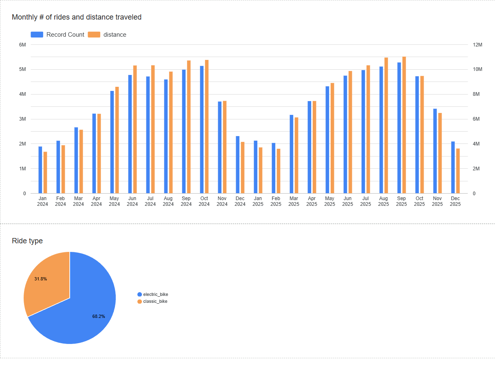

# NYC Citi Bike Data (DE 2026)

Data engineering project for **NYC Citi Bike** (bike share) trip data: ingest historical monthly files, land them in **Google Cloud Storage**, model them in **BigQuery**, and optionally transform them with **dbt**. 

## What it does

1. **Infrastructure (Terraform)**  
   Provisions a GCS bucket and a BigQuery dataset in your GCP project so raw and curated trip data has a place to live. Bucket and dataset names are configurable in `terraform/variables.tf`.

2. **Orchestration (Kestra)**  
   Flows under `kestra/` implement a **backfill** pipeline: for each month, download the official trip data archive from the public **Citi Bike AWS tripdata** bucket, normalize split CSVs if needed, upload CSVs to GCS, and run BigQuery DDL/DML (external tables, merges into a consolidated `citibike_tripdata`-style table). Kestra uses workspace key–value settings (`kestra/kv.yml`) and a GCP service account secret for BigQuery/GCS plugins.

3. **Transformations (dbt)**  
   The `citibike/` directory is a **dbt** project (`nyc_citi_bike_zoomcamp`) with staging and mart layers intended to run on top of the warehouse data built by the pipelines above.

## Repository layout

| Path | Role |
|------|------|
| `docker-compose.yml` | Local **Postgres** (Kestra metadata) + **Kestra** standalone, with `./kestra` mounted as flows. |
| `kestra/` | Flow definitions (e.g. backfill, KV bootstrap). |
| `terraform/` | GCP bucket + BigQuery dataset. |
| `citibike/` | dbt models and project config. |

## Prerequisites

- **Docker** (for Compose-based Kestra)
- **Terraform** (for GCP resources)
- **GCP**: project, APIs enabled for Cloud Storage and BigQuery, and a **service account JSON** with permissions for the bucket and dataset operations your flows perform
- **dbt** (optional, for `citibike/`)
- **Google Data Studio** (dashboards / visualization)

## Configuration and secrets

- **Kestra / Compose**: use a root `.env` (not committed) for values such as `SECRET_GCP_SERVICE_ACCOUNT` (base64-encoded service account JSON used by the Kestra container). See `docker-compose.yml` for which variables are referenced.
- **Terraform**: provider credentials are wired to a key file path in `terraform/main.tf` (`credentials = file("…")`); adjust that path or switch to Workload Identity / env-based auth for production. Override `project_id`, `gcs_bucket_name`, `bq_dataset_name`, and `location` via `terraform.tfvars` or `-var` as needed so they match the Kestra KV settings in `kestra/kv.yml`.

## Quick start (outline)

1. **Terraform** — from `terraform/`: `terraform init`, then `terraform plan` / `apply` after credentials and variables are set.  
2. **Kestra** — from repo root: `docker compose up -d`, open the Kestra UI (port **8080** by default), ensure secrets and KV flows align with your GCP bucket and dataset.  
3. **dbt** — configure a BigQuery profile pointing at your project/dataset, then run `dbt build` from `citibike/`.

## Data source

Trip archives are published by **Citi Bike** / NYC Bike Share; this project downloads from the public dataset host referenced in the Kestra flow (historical monthly ZIPs). Use the data in line with the provider’s license and attribution requirements.

## Dashboards

Google Data Studio was used for the dashboard containing the graphs

